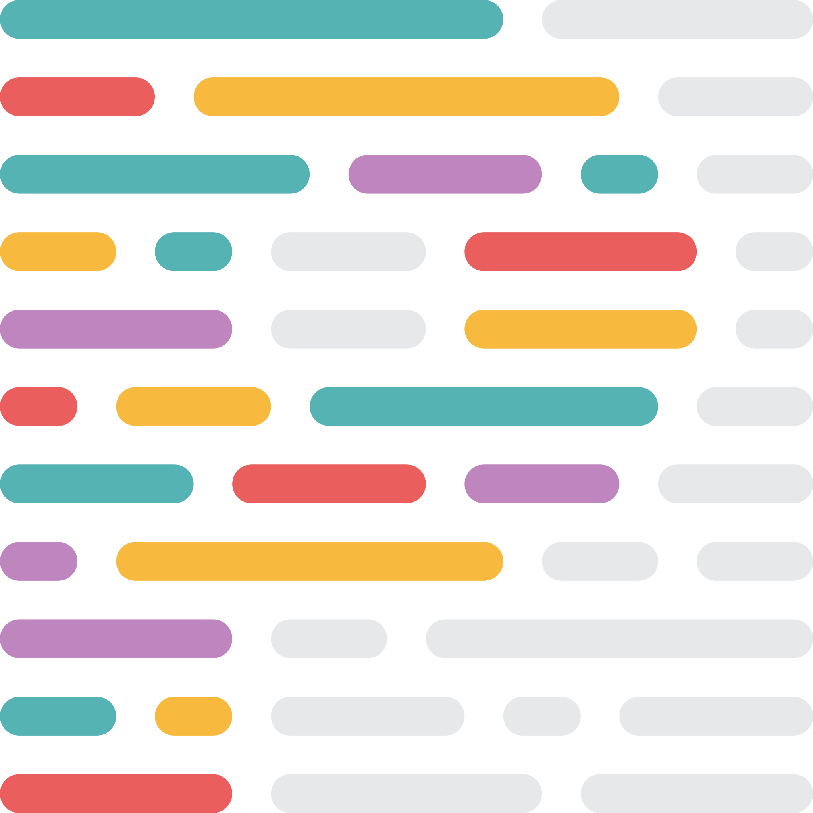
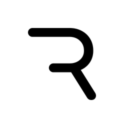

# Hello there! 👋 I'm Daniel 
### I am a front-end developer, I love doing things for web

## Tools, languages, and other things that I like to work with :star_struck:
<!--- 

https://www.vectorlogo.zone/util/preview.html?image=/logos/typescriptlang/typescriptlang-icon.svg
https://devicon-website.vercel.app/api/typescript/original.svg
https://www.vectorlogo.zone/logos/typescriptlang/typescriptlang-icon.svg
 --->
<table width="520px">
    <tbody>
        <tr valign="top">
            <td width="96" align="center">
            
            React
            </td>
            <td width="96" align="center">
            
            Redux
            </td>
            <td width="96" align="center">
            
            TypeScript
            </td>
            <td width="96" align="center">
            
            JavaScript
            </td>
            <td width="96" align="center">
            
            HTML
            </td>
            <td width="96" align="center">
            
            CSS
            </td>
            <td width="96" align="center">
            
            Sass
            </td>
            <td width="96" align="center">
            
            MUI
            </td>
            <td width="96" align="center">
            
            Jest
            </td>
        </tr>
        <tr valign="top">
            <td width="96" align="center">
            
            Storybook
            </td>
            <td width="96" align="center">
            
            VSCode
            </td>
            <td width="96" align="center">
            
            Prettier
            </td>
            <td width="96" align="center">
            
            Eslint
            </td>
            <td width="96" align="center">
            
            Jira
            </td>
            <td width="96" align="center">
            
            Webpack
            </td>
            <td width="96" align="center">
            
            NodeJS
            </td>
            <td width="96" align="center">
            
            Nginx
            </td>
            <td width="96" align="center">
            
            Git
            </td>
        </tr>
          <tr valign="top">
            <td width="96" align="center">
            
            Figma
            </td>
            <td width="96" align="center">
            
            Illustrator
            </td>
            <td width="96" align="center">
            
            AfterEffects
            </td>
            <td width="96" align="center">
            
            Lottie
            </td>
            <td width="96" align="center">
            
            RaspberryPi
            </td>
            <td width="96" align="center">
            
            KaliLinux
            </td>
            <td width="96" align="center">
            
            Debian
            </td>
            <td width="96" align="center">
            
            Vercel
            </td>
            <td width="96" align="center">
            
            Rive
            </td>
        </tr>
    </tbody>
</table>

<!---  --->
## Contacts:

